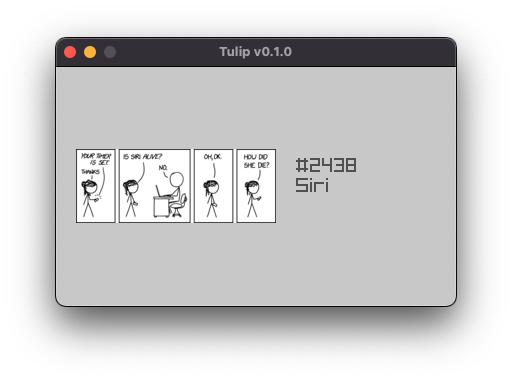

# Project Tulip
> 8th June 2023

This is a small project of messing around with Go + Raylib for a `400x240` 
black and white display. More specifically messing around with the same screen
as the [Beepberry] which is the [Adafruit SHARP Memory Display].



The modules of playing around are called "apps" and don't really have a plan on
what to dev but at the moment a [xkcd] view is done.

## Usage

To run this you'll need to have Go [installed] as well as the `raylib` 
development files/libaries which you can easily do by following the [raylib-go] 
repo. Once installed the files then you can just run the following:

```bash
go run main.go
```

> **Note:** The first time you run this if you haven't used `raylib` before the
>           first run/build might take a little bit as it will build the 
>           `raylib` binaries/libraries.

[Beepberry]: https://beepberry.sqfmi.com/
[Adafruit SHARP Memory Display]: https://core-electronics.com.au/adafruit-sharp-memory-display-breakout-2-7-400x240-monochrome.html
[xkcd]: https://xkcd.com/
[installed]: https://go.dev/doc/install
[raylib-go]: https://github.com/gen2brain/raylib-go